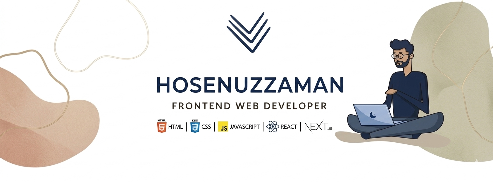

  

<h1 align="center">Hi 👋, I'm Hosenuzzaman</h1>
<h3 align="center">Frontend Developer | CSE Student</h3>

---

### 👨‍💻 About Me
- 🎓 I am a CSE student from Bangladesh  
- 💻 I love building responsive and modern web applications  
- 🚀 Currently learning Next.js & Backend Development  
- 🎯 Goal: Become a Full Stack Developer  

---

### 🌐 Connect with me:

---

### 🚀 Languages and Tools:

---

### 📊 GitHub Stats

